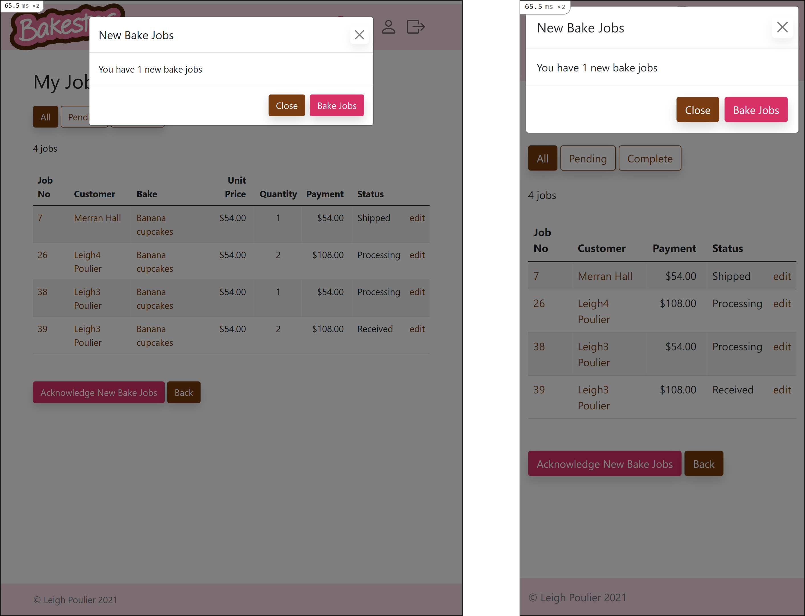

# Bakester
### Links

|Links||
|-|-|
|Deployed Website:|<http://bakester.herokuapp.com>|
|Github:|<https://github.com/leighpoulier/bakester>|
|Trello:|<https://trello.com/b/Uayp6SHv/bakester>|

## About Bakester

Bakester is a Ruby on Rails web app where people can buy "bakes" from home bakers.  "Bakes" might include cakes, cupcakes, slices, pies, pastries, tarts, desserts etc. On Bakester a home baker can advertise baked items they are able and willing to produce in exchange for payment, and any other user can place an order for a specific bake.  The baker receives the order, produces the bake, and delivers it to the customer.

### The Problem

"Car Cake" by Anne (source: BBC - The Great British Bake Off: An Extra Slice)

Many people, particularly those with young kids, may feel pressured to provide an impressive celebration cake for an upcoming event such as a kid's birthday.  The pressures of social media and the demands of the honourary child place the parent in a difficult position, particularly for those without the skills to bake at home.

Non-bakers may look into sourcing a cake from a local supplier, however professionally made cakes can be very expensive, and are oriented more towards large celebrations such as weddings.  Such cakes are outside the budget of most people planning a smaller event, and may be considered overkill.  The aim this website aims to fill the gap by providing access to affordable home baked celebration cakes and other bakes.

The flipside of this situation is someone who DOES have the skills and time to bake at home, and is interested in making a bit of money from those skills. The home baker can post a listing called a "bake" on Bakester, to offer home baked celebration cakes or other items to the general community in exchange for payment.

### Target Audience

This web app aims to provide a marketplace solution to the above problems for two classes of users.

|User Type|Definition|
|---|---|
|Customers| People who want to buy a home made cake or other baked item rather than make it themselves, due to lack of ability, time etc.|
|Bakers|People who want to bake at home on behalf of others in exchange for payment.|

A third type of administrative user called an "Admin" is also part of the design for this web app, although this user does not necessarily participate in the marketplace.

## The Bakester Web App

Bakester was developed to provide a place for people to purchase home made bakes from other people.  The main use case for the site is the need for a celebration cake, such as a birthday cake for a child.  However, any type of home made baked item can be listed and ordered on the site. 

### Features

The website implements the following features:

<strong>General</strong>
- Neopolitan icecream colour scheme (chocolate, strawberry and vanilla) to add to the sweetness.
- Responsive design which adapts to mobile, tablet and desktop views.

<strong>Customers</strong>
- Card based layout to view available bakes
- Search / filter / sort function for the list of bakes. 
- Cart where bakes may be placed in order to prepare a list for checkout.
- Checkout function which finalises the cart into an order.
- Past orders page to keep track of orders and their progress
- Upgrade a "customer" account into a "baker" account which changes the UI

<strong>Bakers</strong>
- Add and edit bake listings
- Upload an image on a bake listing.  Images are stored in an Amazon S3 bucket.
- View my bakes, and manage their visibility to customers on the site.
- View my jobs, which are elements of customer orders containing a single bake.
- Receive a notification of new jobs at login
- Acknowledge recipt of a job, and update the status as it is produced and shipped.

<strong>Admin</strong>
- Manage many aspects of the site as if they were the owner.  For example
   - Create new categories
   - Moderate bakes for unacceptable user generated content.  Edit bakes, remove images, or delete bakes completetely if they are unreferenced in the database.
   - View all bakes, even if they are hidden.
   - View any user's cart and past orders.
   - View any baker's list of bake jobs, and edit their status.

### Tech Stack

Bakester uses a Ruby on Rails application framework.  All of the programming code is written in Ruby, and the individual web pages are written in html with embedded Ruby, preprocessed by the puma server and delivered to the browser as standard HTML.  Pages are styled using SCSS.

The backend database is managed by PostgreSQL.

Bakester makes use the following additional components:
- Devise - a rails engine for login authorisation and user, session, and password management.
- Bootsrap - for styling and standardised features such as buttons, modal popup dialog boxes and tooltips.  Many of the standard bootstrap styles are customised and extended, in particular colours.
- JQuery - for a small amount of required client side scripting, including modal popups and tooltips.
- MiniMagick - a ruby gem for image manipulation - which is used to reduce the size of uploaded images before sending them to the Amazon S3 bucket.  

Bakester is deployed to a Heroku on a free "Hobby Dev" level account.

### Third Party Services

Bakester makes use of Amazon Web Services S3 buckets for it's image storage.  Two different buckets are setup, one for the development environment, and one for the production.  This is so that the development bucket can be cleared easily, without affecting the online Heroku hosted website.

Images may be attached to bakes by bakers when they create or update a bake.  The Rails controller action which handles this first resizes this image to maximum of 500x500 pixels, to ensure that large images do not get uploaded to the amazon servers, and to ensure fast download speeds when images are requested by browsers.  The resizing is handled by a ruby gem called "MiniMagick".

### Sitemap

The following diagram represents a map of the main areas of the Bakester site and the typical flow of navigation between them.  The bold "Bakes" node is the root of the site, and all initial access to the site starts on this page, which includes a listing of all the bakes available for order.

There are four shaded regions on the sitemap, which represent the three classes of user accessing the site and a fourth state where the user is not logged in.

### Walkthrough / Screenshots

Different parts of the site are available according to the users' status as follows:

#### Not Logged in
A user who is not logged in can the browse bakes available on the site, and add them to their cart, but cannot checkout without signing in.  They can also view other user profiles.

#### Logged in as User
When logged in as a standard user, the above features are available, and checkout functionality is added.  A user can also manage one's own account and view one's own past orders.  There is also a function available to upgrade one's account to "baker" status.

#### Logged in as Baker
After upgrading their account to a baker, the baker can access all of the above functions with the addition of creating and editing bake listings, and managing their own bake jobs.  

#### Logged in as Admin
An admin can access all of the above, with the addition of the ability to manage all users, categories, bakes, orders and bake jobs.

However, an admin is not automatically a baker, they too will need to upgrade their account to baker if they wish to create bakes and manage bakejobs in their own name.

### Walkthrough / Screenshots

We will following a typical user journey as they move through the site, create an account, use the features available to a user, upgrade their account to baker, and use the features available to a baker.  Following this the features available to an Admin will be presented.

#### New user first contact

When a new user first accesses the site, they are presented with the bakes list.  This is a vertical scrollable list of bakes presented on cards, which responsively adapts by expanding up to 3 columns wide.

On the mobile view, a hamburger menu replaces the navigation bar icons.  Pressing the hamburger button opens a drawer containing the navigation links

Bakester main page on mobile and tablet.

Bakester main page on desktop.

#### Navigation

On mobile view, the navigation menu expands downward once the hamburger is pressed, and displays additional options for a logged in user, a baker, and an admin (who is also a baker in this case).

Also visible in the below image are the badges added on the "cart" icon and "my jobs" icon, to indicate that there are items in the cart, or new jobs respectively.

On a tablet and desktop, the hamburger button disappears and is replaced by a horizontal list of icons.  The following image displays tablet view, but desktop is the same except for its width.

#### Search

On the bake listing page, a search form is available where the user can search by text, filter various properties of the bakes, and sort by any property in ascending or descending direction.  By default only the search text field, the category select box and the sort select boxes are visible, but clicking on the "Advanced Search" text expands the rest of the search form to show all available search and filter options.

Bake search form on mobile.

Bake search form on tablet.

Bake search form on desktop.

#### View Bake

The user can click on a bake in the main list, and be taken to it's detail page to read the full description and view a larger image

Bake view page on mobile and tablet.

Bake view page on desktop.

#### View Cart

Once the user clicks "Add to Cart", the bake is added to their cart.  If they are not logged in this is handled by session storage, and for a logged in user it is stored in the database. After clicking on the navigation link to view their cart they will be presented with the view cart page.

Cart view page on mobile and tablet.

Cart view page on desktop.

#### Check Out

The user can then press the "Checkout" button, which after confirmation transforms the cart into an order and sends bake jobs to bakers.  After checking out, the user sees the new order confirmation.

Completed order page on mobile and tablet.

Completed order page on desktop.

#### My Account

Links to upgrade to baker are provided on the navigation bar (see above).  The link can also be accessed from the "My Account" page, along with options to edit username, email and password.

My account page on mobile.

My account page on mobile.

My account page on mobile.

#### My Bakes

After upgrading their account to a baker the user will be able to add a new bake using the "new bake" option in the navigation menu.  They will then be presented with the form for creating or editing bakes.

Bake form on mobile.

Bake form on tablet.

Bake form on desktop.

#### Edit a Bake

After the creating a new bake, it will appear with an "Edit" button instead of "Add to Cart" in all views. For example in desktop view it can be seen that the first of these three bakes is owned by the currently logged in baker and therefore can be edited:

Edit button on bake card on desktop.

Once the edit button is clicked the same form will be populated with that bake and can be edited.

Bake edit form on mobile.

Bake edit form on tablet.

Bake edit form on desktop.

#### Receiving a new job

If another user makes an order for a bake, a modal popup will appear to indicate this to the baker.

New Bake Job modal on mobile and tablet.

New Bake Job modal on desktop.

#### Managing Bake Jobs

This modal prompt will provide a link to the Bake Jobs page, where the baker can see the status of all bake jobs and filter them by their completed status.

My bake jobs page on mobile and tablet.

My bake jobs page on desktop.

#### Updating Bake Job Status

If the baker clicks on link on the Job Number, or the "edit" link to the right, the status of the bake job can be updated to "Processing", "Shipped", "Delivered"

Edit bake job status on mobile and tablet.

Edit bake job status on desktop.

#### Admin page

An admin user can access an admin dashbord, from where they can manage all entities of the web app, including categores, users, bakes, orders, and bake jobs.

Admin page on mobile and tablet.

Admin page on desktop.

#### All Users listing

Clicking on the "Users" link opens the admin-only Users index page which lists all users, and provides links to view their carts, orders, bake_jobs, and profiles.

Users list on mobile and tablet.

Users list on desktop.

#### Categories List

From the Admin page, clicking on the "Categories" link opens the categories list, from which categories can be edited and deleted if they are empty.

Categories list on mobile and tablet.

Categories list on desktop.

#### All Bakes 

The "All Bakes" link takes the administrator to the previously discussed Bakes list, but includes some admin only search form parameters - enabling the inclusion of hidden bakes.

#### All Orders

The "All Orders" link takes the administrator to a list of all orders existing on the site, including not yet submitted bake_orders (saved carts), and can be filtered by status (submitted or cart)

All Orders list on mobile and tablet.

All Orders list on desktop.

#### All Bake Jobs

The "All Bake Jobs" link shows the administrator a list of all bake_jobs in the site, and can be filtered based on status (Pending, Complete, Cancelled, In Cart).

All Bake Jobs list on mobile and tablet.

All Bake Jobs list on desktop.

## Under the hood

### Database

The database underneath Bakester is provided by PostgreSQL.  The main abstractions stored in the database are <strong>users</strong>, <strong>categories</strong>, <strong>bakes</strong>, <strong>bake_orders</strong> and <strong>bake_jobs</strong>.  Additional tables "active_storage_attachments", "active_storage_blobs" and "active_storage_variant_records" were automatically added for the storage of information related to the images of bakes, which are handled as ActiveStorage attachments.

#### Entity Relationship Diagram (ERD)

[Bakester Entity Relationship Diagram - Click here for a larger version](docs/erd/bakester.erd.png)

#### Users

A user is a person who uses the site and holds an account. Information relating to the user is used to manage the sign up and login process and identify who is responsible for the various other entities of the app.

The users table stores information relating to the users of the database.  Most of the fields in the users table were created by the Rails engine "Devise", although some extra fields have been added manually, such as the "admin" boolean and the "baker" boolean, which define the users status in those regards.  The "boolean_at" field keeps a record of the date and time that the user became a baker. Fields for "first_name" and "last_name" were created in addition to the default email so that more personalisation was possible in the app's views.

Foreign Keys links to the users "id" column are used in the orders table, to define the owner of an order, and the bakes table, to define the "baker" of a bake.  Each user has many orders, and is the baker of many bakes.

#### Categories

All bakes are placed in to a category when they are created.  The list of categories is available for selection in the bake create/update form, but only admin users are able to create, update, or delete categories.  Only the "name" field is used throughout the app's views.

A Foreign Key field linking to the categories "id" column are present on the bakes table, which defines which category a bake belongs to, and defines a one-to-many relationship.  Each category has many bakes.

#### Bakes

A bake is the product of the web app.  It is a baked item that is offered for sale by a baker for other users to order.

The bakes table holds the records of all the bakes that bakers have uploaded to the site for sale.  It includes many fields to describe the bake, such as "name", "description" and "price".

Some bakes may include multiple items, for example a batch of 12 cupcakes, and so additional fields are used to store the "unit_count" (12) and "unit", (the name of the basic unit of the  bake, eg "cupcake").  Additional tooltips are provided in the bake create/edit form to explain these fields, as experience has shown them not to be intuitive.

A "view_count" field keeps track of how many times a bake has been viewed, so that it's popularity can be gauged by the baker or customers.  The field "lead_time_days" records how many days a baker requires in order to create a bake, and gives the customer an idea of how much time needs to be allowed following an order.  It also allows the customer to filter out bakes that cannot be provided in the available time before an event.

The "baker_id" field is a foreign_key field which relates to the "users" table, and defines the "baker" (user) of this bake.  It is used to define who may edit the bake, and where bake jobs containing this bake are sent.  The relationship is one-to-many.  One baker (user) can have many bakes.

The "category_id" field defines which category the bake belongs to, and makes a "one-to-many" relationship.  Each bake has one category, but each category has many bakes.

A Foreign Key field linking to the bakes "id" column is used in the bake_jobs table to define which bake is being requested as part of a bake job. This defines a one-to-many relationship, where each bake_job relates to one bake.

#### Bake Orders

A "Bake Order", or an order(*) is created by a user when they create a cart, and proceed through checkout.  It contains a list of bake_jobs, which are the tasks that are sent to bakers for production.

A cart is a special unfished bake order, of which there should only be one per user if any.  The field "submitted" defines whether a cart has been transformed into a bake order, although both are stored in the same "bake_orders" table.  A "submitted_at" field records a time stamp of when this happened.

This restriction is only enforced in the logic of the `BakeOrder` controller, and i could not find a way to ensure only one cart existed per user inside the database, because the same table is used to store multiple past orders.

The "user_id" field is a foreign key referring to the "users" table, and relates the bake order to a user through a one-to-many relationship. One user can have many bake orders.

A Foreign key field to the bake orders "id" column is used in the "bake jobs" table, which defines which bake_order is the "parent" of the bake job.  This defines a one-to-many relationship. All bake_jobs are related to one order, but each bake_order contains many bake_jobs.

* Initially this table and the model was name "order" but it was found that it conflicted with the built-in Rails ActiveRecord query method "order" which is used to define the sort column and direction of an ActiveRecord relation.

#### Bake Jobs

A bake_job is a line item of a Bake Order.  Each bake order can contain many different bakes each provided by a different baker.  A bake_job encapsulates the information required to be sent to a baker to fulfil an order, which bake, how many etc.

A "bake_job" defines the details of a particular transaction, and is a join table between the "bake_orders" and "bakes" table.  Each bake_job contains foreign key fields for a bake_order (one-to_many) and a bake (one_to_many). Through these two relationships there is therefore a many-to-many relationship between bakes and bake orders.  Each bake_order can contain many bakes, and each bake may appear in many bake orders.

The user checks out an entire order at once, which may consist of many bake_orders, each of which has it's own baker and status to be managed by that baker.  The "status" field is updated by bakers when they manage their bake jobs, and the customer can view that bake job's status as part of their order.  A field "quantity" tracks if multiple of a particular bake were ordered in one go, and the field "price_at_order" is used to keep track of the price of the bake at the time of the transaction, which differ from the current price of the bake.

#### Active Storage

Each bake has an image, but these are not stored in the bakes table.  

The "active_storage_blobs" table stores information about attached files, including size, a checksum, content type, original filename and the name of the service storing the attachment.

The table "active_storage_attachments" records information related to the relationship between the bake and the "storage_blob".  It is related to the bakes table through a polymorphic join.  The "record_type" and "record_id" strings define the relationship, with the "record_type" equal to "Bake" for this database, and the "record_id" being a foreign key field defining a one to many relationsip with bakes.  Each bake could have multiple attached images, although in my implementation there is only one.

The "active_storage_attachments" table also contains a foreign key field for "blob_id" which creates a one-to-many relationship to the "active_storage_blobs" table.  This actually makes the "active_storage_attachments" table a join table, and the relationship from bakes to active_storage_blobs through active_storage_attachments is many_to_many.  This means that each bake can refer to many blobs, and each blob can be related to many bakes, which helps to ensure that there is no need for duplication of attached files.

I have no idea what the "active_storage_variant_records" talbe is for.  It is empty in my database, but it also refes to the blobs table with a foreign key "blob_id", so i assume it is some sort of record of varation or variants to each image.

### Models

The same 5 main abstractions (users, categories, bakes, bake orders and bake_jobs) are implemented as models in the Rails MVC (model, view, controller) paradigm.

Although the foundation of the associations between them is as discussed above in the database relationships, there are many additional details implemented in each model definition.

#### User model

The User model, although created automatically with devise, has been customised to add additional functionality required by the Bakester app.

Mirroring the database relationships, the User model has many bakes, and many bake_orders. 

A "bake_jobs" association is defined which relates a user to bake_jobs through the bake_orders table.  This means that it is possible to quickly determine who was the origin of a bake_job.  

In addition an association called "carts" is defined, related to the "BakeOrder" model.  It returns only bake orders which are not submitted, related to a particular user.  There is nothing stopping an error in logic inserting multiple carts for one user into the bake_orders table, although there SHOULD be only one.  When ever this scope is used in practice, it is chained with .first, so that only one cart is returned.  The "carts" association also employs eager loading to include references to the component bake_jobs and bakes as part of the order.

A "bakers" scope filters the users table to only those users which are bakers (as defined by the "baker" boolean column).

An "eager_loading" scope aims to speed up query of the users table, and includes bakes, categories, and image attachments.  When viewing a user profile, all their bakes are displayed and this scope ensures limits the number of queries required to build that view.

Additional helper methods are required which join the users first_name and last_name columns into a "full_name", and return the first cart (from the carts scope), and return the size of the user's cart.

#### Category model

The category model is comparitively simple, and defines the expected "has many" association with the bakes model.  This means each category relates to many bakes.

One helper method "filter_options" builds the list of categories that is displayed in various select boxes within the app, and prepends an "All" option.

#### Bake model

The Bake is rather more involved.

Some constants are defined which govern the behaviour of the image resizing feature, and also hard cord the fields by which the bakes listing may be sorted.

Each Bake belongs to a user in two distinct ways.  A User may be associated to a Bake through the BakeJobs and BakeOrders model, as "a user who has ordered this bake".  A User can also be related directly to the User model, as "a user who owns this bake".  Becuase user is ambiguous, the term "baker" is used to define the owner of a bake, and the assocation is define in the model as "belongs_to :baker, class_name: "User" to avoid this potential conflict.

Each Bake is associated to a Category with a "belongs_to" association.  This means each bake "has one" category

The Bake model has "has_many" assocations on the BakeJob model, and also the BakeOrder model through the BakeJob model, as detailed above.  It also "has_one_attached" :image, although a future feature may be to be able to add multiple images.

Many scope are defined to implement the search / filter / sort feature of the bakes index page.  A few helper scopes are defined, which each implement one aspect of the feature, such as text searching, filtering on price, category, or lead time.  The text search scope actually splits a multi-word search up in to an array of strings so that the words can be AND'd, which means that he words don't have to appear in the entered order.

A very large and complicated scope builds up an ActiveRecord relationship with all these helper scopes, which returns the data set requested in the form.

#### Bake Order model

The BakeOrder model implements a "belongs_to" association with the User model, which means each BakeOrder has one user who created it.

There is a "has_many" assocation in the BakeOrder model with the BakeJob model, because each bake_order contains many bake_jobs.  If a bake_order is destroyed (or a cart is emptied), related bake_job model objects will be deleted also, due to the "dependent destroy" addition.

Each Bake Order also "has_many" bakes, through the "bake_jobs" join table. This means it is easy to access the list of bakes contained within the bake_jobs which are themselves contained within a bake_order.

Each Bake Order also "has_many" bakers, as they are associated with their bakes.  This is a double "through" "many-to-many" relationship, where the BakeOrder model is associated to the User model (as baker) through the BakeJob model and the Bake model.

An eager loading scope is used to improve load times for views accessing a bake order, and allows the related User, Baker and BakeJob information to be loaded in one query.

Scopes "submitted" and "carts" are mutually exclusive, and restrict the returned set of bake_orders to those which are carts (not submitted) or submitted bake orders.

#### Bake Job model

The BakeJob is a joining model, with "belongs_to" assocations to both the BakeOrder model and Bake model.  Each BakeJob refers to one Bake and one BakeOrder, which implements the many-to-many relationship between bake_orders and bakes.

The BakeJob model also defines an association to the User model, through the Bake model.  This relates the baker of a bake to the bake_job.  The BakeJob could also define an association to the User model through BakeOrder, as the customer who created the job, but this was removed as it wasn't actually required for the functionality of the app.

An enum defines the available values of the "status" field, relating a hash of values with integers which are stored in the database.  This gives man helper methods to the model, including one for each enumerated value.  A few additional scopes are defined to enable more general filtereing of bake_jobs based on their status, which can be seen on the Bake Job index view.

Eager loading is also implemented on the model, so that queries may include related fields from the BakeOrder model, the Bake model and it's related User model (as baker).

## Design Process

### User Stories

When designing the website and its functions, the following user stories were used to clarify the required funcitonality of the website.  In these defnitions, an "order" is what the customer creates, and a "job" is the task that the baker receives.

#### Customers

As a <strong>Customer</strong>...

|I want to...|So that i can...|
|---|---|
|Browse all bakes| see what bakes are available|
|Search and filter bakes | drill down to the types of bakes i am looking for|
|View a bake| see details about the bake and its description|
|Sign up for a new account| make orders for bakes|
|Log in to my account| see details of my past orders|
|Change my password | keep my account secure|
|Edit my account details | correct/update my name or email|
|Add a bake to my cart | build up a basket of bakes to order |
|Checkout | place an order with a baker|
|See my orders | keep track of the progress of my orders|
|View a User| see details of a user, in particular a baker's bakes|
|Become a baker| sell my home bakes on Bakester|

#### Bakers

As a <strong>Baker</strong>...

|I want to...|So that i can...|
|---|---|
|Do everything a customer can do|still act as a customer|
|Add a bake listing| start to receive customer orders for that bake|
|Add an image to a bake| make the bake more appealing to customers|
|Edit bake| update or correct details of my bakes|
|Hide a bake| temporarily prevent customers from placing an order|
|Delete a bake| permanently remove a bake |
|View my bakes| keep track of what bakes i am offering|
|Be notified of new jobs | i am aware of new jobs as soon as customers checkout|
|View my jobs| keep track of the customer orders that i need to fulfil|
|Update Job status| Track which jobs i have completed, and which are still pending|

#### Admin

As an <strong>Admin</strong>...

|I want to...|So that i can...|
|---|---|
|View categories| know what categories are provided for bakers to classify their bakes|
|Add a category| bakers can use it to classify their bakes|
|Edit a category| correct / update a category name|
|Delete a category| permanently remove a category from the site|
|Edit a bake| moderate content provided by bakers|
|Delete a bake| permanently remove a bake |
|See all users| know about all the users signed up on the site|
|Edit a user| change a user's name or email|
|Delete a user| close a user's account|
|See all orders | know about all the orders placed on the site|
|See the orders from a customer| investigate problems on behalf of a customer|
|See all jobs | know about all the jobs assigned to bakers|
|See all jobs for a particular baker| investigate problems on behalf of a baker|

### Project Management

To manage the creation of this site, a [trello board](https://trello.com/b/Uayp6SHv/bakester) was implemented.  Each user story above and many other design tasks were moved through four stages:

|Stage|Description|
|---|---|
|Backlog|A place for all tasks until they are prioritised
|Current| Tasks that are prioritised to be completed in the short term
|Work in Progress| The tasks that are currently being worked on
|Complete| Tasks that are finished and active on the site

Some features are not as yet implemented, and remain on the backlog, such as comments and ratings for users and bakes.

### Wireframes

The following wireframes were created to crystalise my vision of the layout of various core pages of the web site.  We will follow the journey of a new user through first access, signup, use of the site as a customer, and then use of the site as a baker.

#### Main page

When the user first accesses the site, they will be presented with a screen containing all of the bakes that are available on the site.  Sign up or log in is not required to view this list.  A grid of cards is presented, each linking to a bake's own page.  A search / filter / sort form is provided to customise the listing.  

Main bakes page - mobile and tablet

Main bakes page - desktop

To navigate the site on desktop and tablet, a navigation bar is provided at the top of the page with a horizontal list of links.  In the mobile view, the navigation bar is compacted and a hamburger button replaces the horizontal list, and when activated displays a drawer containing the same links.

#### Sign Up

After deciding to become an active user of the site, the user can sign up

Main bakes page - mobile and tablet

Main bakes page - desktop

#### View Bake

For more detail on a particular bake, a user can click on it and access a detail page

Bake page - mobile and tablet

Bake page - desktop

#### Cart

A bake can be added to cart from either the card on the bakes list, or a bake detail page.  The cart page shows the bakes currently in the users cart.

Cart page - mobile and tablet

Cart page - desktop

#### Edit Bake

After upgrading their account to a baker, the user is now classed a "baker" and is able to create or edit their own bakes.  A form is provided including functionality to upload an image.

Edit Bake page - mobile and tablet

Edit Bake page - desktop

The navigation menu has changed and more options are available to a baker to manager their bakes listed on the site

#### Bake Jobs

Once a user has made an order for a baker's bake, the baker is notified they have a new bake job.  The baker can view the list of their bake jobs to manage their tasks.

Bake Jobs page - mobile and tablet

Bake Jobs page - desktop

#### Edit Bake Job

A baker can edit the status of their bake jobs to keep track of what is pending, and also keep the customer updated.

Edit Bake Job page - mobile and tablet

Edit Bake Job page - desktop

# README

This README would normally document whatever steps are necessary to get the
application up and running.

Things you may want to cover:

* Ruby version

* System dependencies

* Configuration

* Database creation

* Database initialization

* How to run the test suite

* Services (job queues, cache servers, search engines, etc.)

* Deployment instructions

* ...
